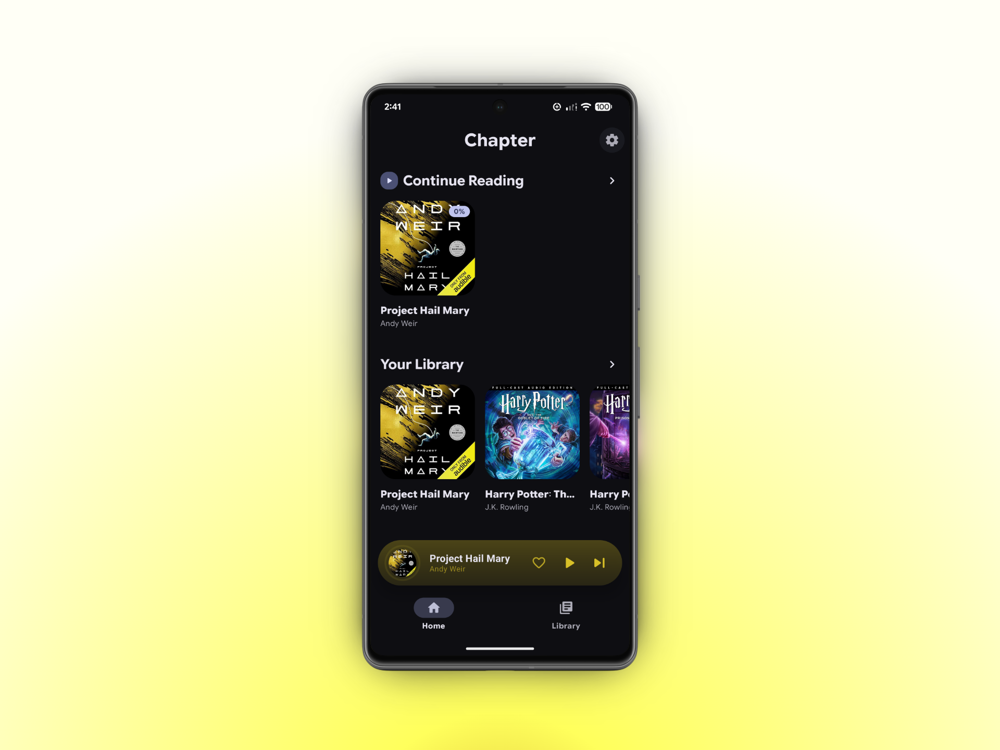
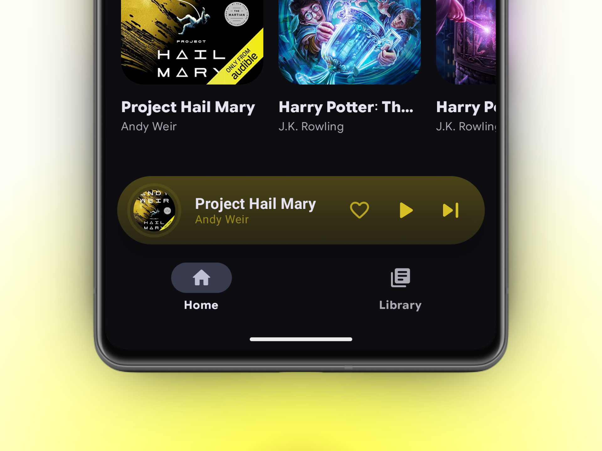
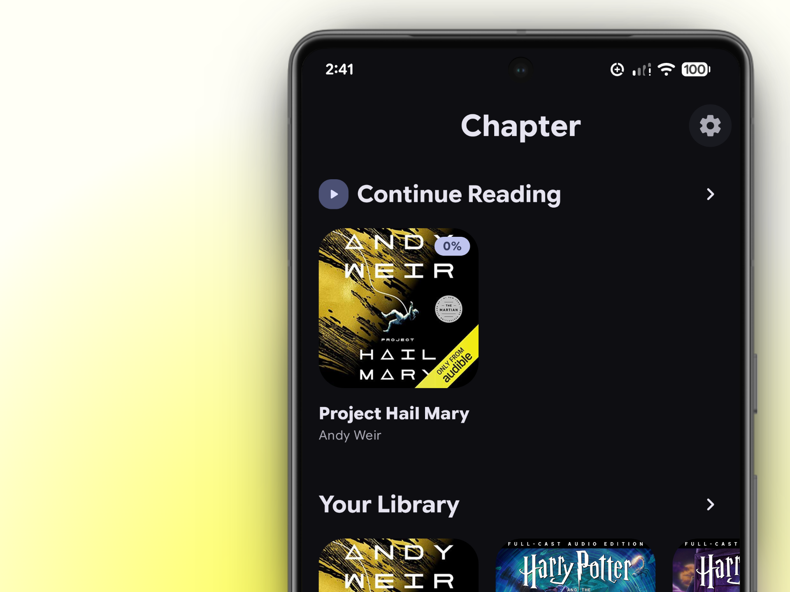
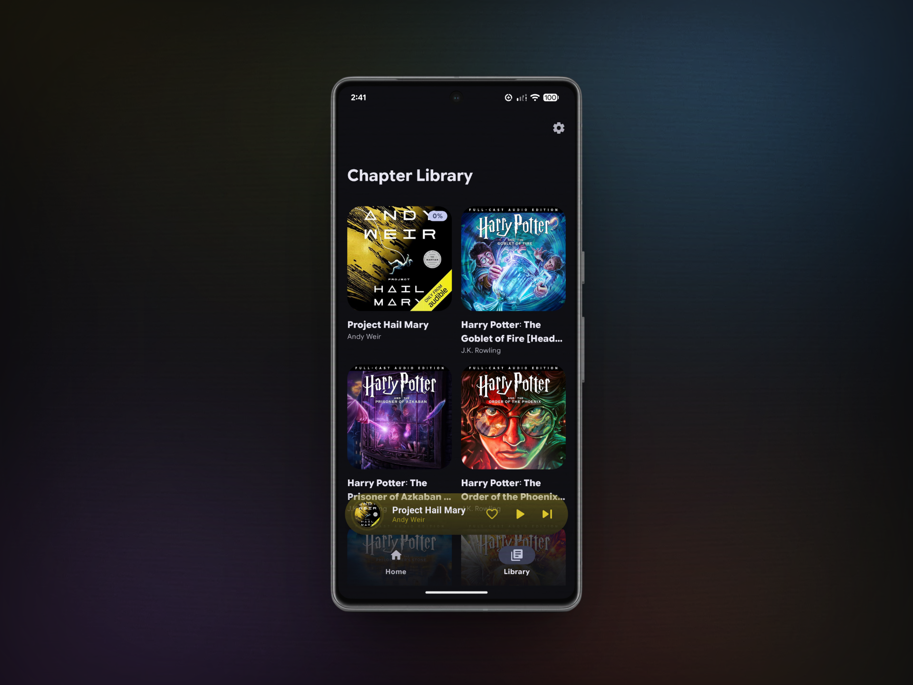
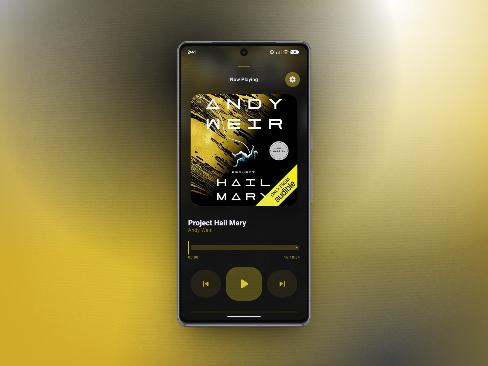
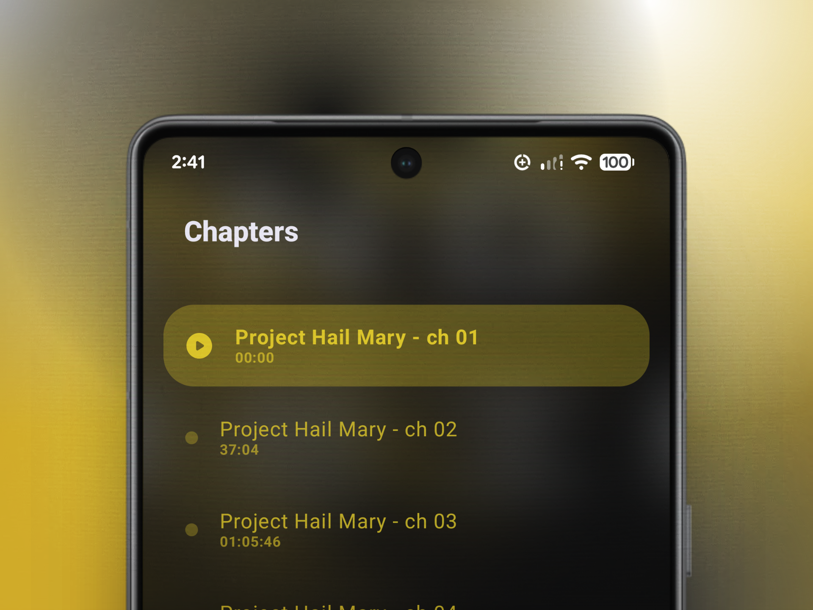
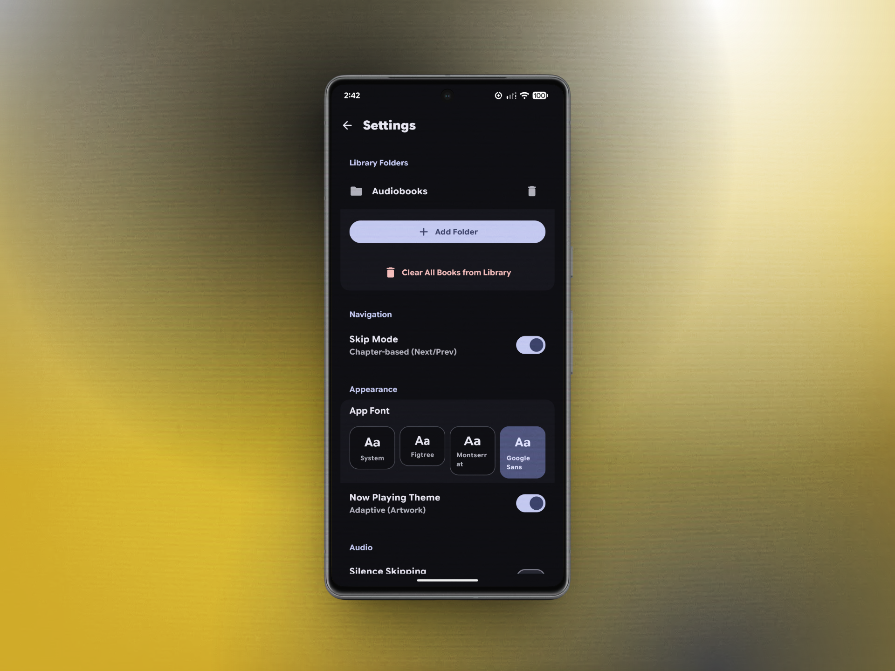
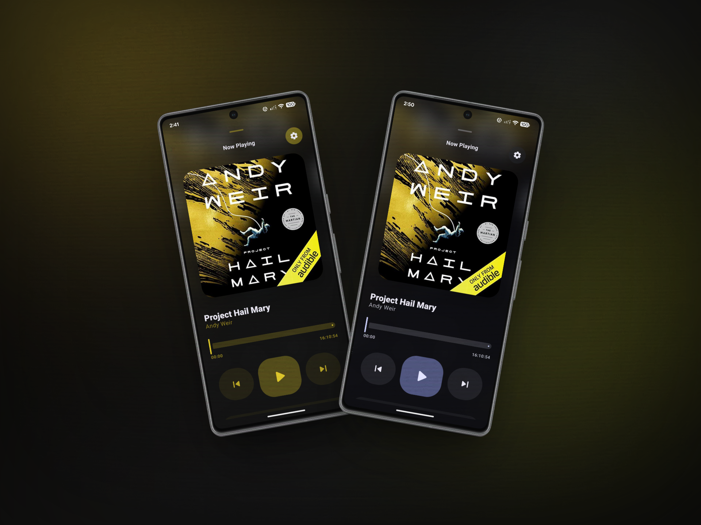

  

# 📖 Chapter - Material 3 Expressive Audiobook Player

Chapter is a modern, elegant audiobook player for Android, built with Jetpack Compose and Material 3 Expressive. It focuses on a clean user experience, dynamic theming based on book artwork, and robust multi-file support.

## 🎨 Features

- **Dynamic Theming**: The player's palette automatically adapts to the current book's artwork, creating an immersive listening experience.
- **Multi-File Support**: Seamlessly plays audiobooks split across multiple files, treating them as a single cohesive unit with unified progress and chapter tracking.
- **Smart Persistence**: Automatically saves your playback position and bookmarks to a Room database, resuming exactly where you left off.
- **Intuitive Gestures**:
    - **Play/Pause**: Single tap to toggle, long-press to quickly change playback speed.
    - **Sleep Timer**: Single tap to set a custom timer, long-press to quickly add 15 minutes.
- **Library Management**: Automatic scanning of local storage to find and organize your audiobooks.
- **Shared Transitions**: Beautiful, fluid animations when navigating between the library and the player.
- **Customizable Typography**: Tailored reading/listening experience with adjustable text styles.

## 📸 Screenshots
### 🏠 Home Screen

### 🎶 Now Playing Pill - See what you're listening to in a modern Now Playing pill

### 📘 Continue Reading - Continue where you left off

### 📚 Library Screen - View all of your books in one place

### 🎵 Now Playing Screen - See what you're listening to in a full-screen layout

### 🔖 Chapters - Find and skip to specific chapters in your book (only some books supported)

### ⚙️ Settings - Customize your experience with various options

### 🖌️ Material You vs Adaptive Colors - Choose for the app to adapt to your device's color scheme or adapt to the currently playing Audiobook

## 🛠️ Built With

- **[Jetpack Compose](https://developer.android.com/jetpack/compose)** - Modern toolkit for building native UI.
- **[Material 3 Expressive](https://m3.material.io/)** - The latest evolution of Material Design.
- **[Media3 (ExoPlayer)](https://developer.android.com/guide/topics/media/media3)** - High-performance media playback engine.
- **[Room](https://developer.android.com/training/data-storage/room)** - SQLite object mapping library for data persistence.
- **[Coil](https://coil-kt.github.io/coil/)** - Image loading library for Android backed by Kotlin Coroutines.
- **[Palette](https://developer.android.com/training/material/palette-colors)** - Extracting prominent colors from images for dynamic theming.
- **[Navigation Compose](https://developer.android.com/jetpack/compose/navigation)** - Navigation component for Compose.

## 🚀 Getting Started

1. Clone the repository.
2. Open the project in Android Studio (Ladybug or newer recommended).
3. Sync Gradle and run the app on an emulator or physical device.

##  ✏️️ Contributing
Contribute to the project by forking the repository and creating a new branch with your own changes. If you would like to submit this, please create a pull request to the **Chapter** repository with a detailed description of your changes.

Help is much appreciated! ❤️

## 📄 License

This project is licensed under the MIT License - see the [LICENSE](LICENSE) file for details.
